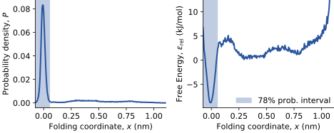
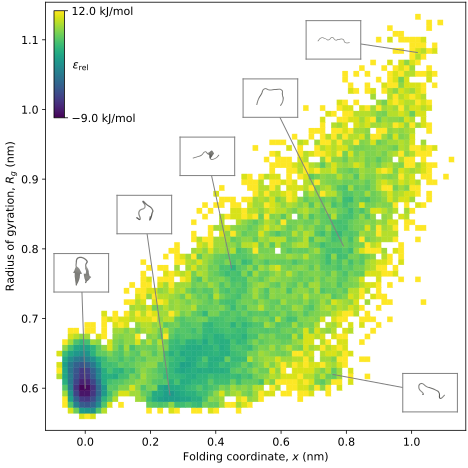

# Minute of diversity

----

{width="40%"}

{width="40%"}
{width="40%"}

# Basic MD is slow

## Goals of an MD simulation

- Get an equilibrium ensemble of states of a system
- ... so that we can calculate some equilibrium property
  - Rate
  - Free energy change
  - Average macroscopic observable
  - Lowest energy structure
- Non-equilibrium properties much harder

## Biomolecules conspire against us

- Many interesting states with rare transitions
  - solvation changes
  - side chain rotation

# The Free Energy Landscape

## Free Energy is probability

$$
    \epsilon_{\mathrm{rel}}(x) = - K_B T \log(P(x))
$$

- Energy is just maths applied to the probability
- Energy barriers are just transition regions of low probability
- If we know the FES along an interesting variable, we can calculate the average value by integrating over it

----

{width=1500px}

----

# Get that ensemble with slow sampling

